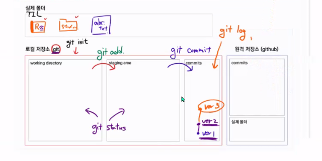

### Git 기초


**1. 왜 Git을 이용한 버전 관리가 필요한가?**

Git: (분산)버전 관리 프로그램

`버전`: 컴퓨터 소프트웨어의 특정상태

`관리`

`프로그램`: 컴퓨터에서 실행될 때 특정 작업을 수행하는 일련의 명령어들의 모음


> 버전 관리 =  컴퓨터 소프트웨어의 특정 상태들을 관리하는 것?
>
> But, 우리는 이미 버전 관리를 알고 있다

```
마케팅관리_레포트_최종.docx
마케팅관리_레포트_진짜최종.docx
마케팅관리_레포트_진짜진짜최종.docx
마케팅관리_레포트_진짜리얼최종.docx
```

어느 것이 진짜 최종이지?


>  파일에 날짜와 시간을 적어봐!

```
마케팅관리_레포트_211201_1604.docx
마케팅관리_레포트_211202_1215.docx
마케팅관리_레포트_211203_0530.docx`
```

어느 부분을 수정했더라?


> 변경사항을 기록하는 파일을 만들어 봐!

```
마케팅관리_변경사항_211201_1604.docx
```

레포트 1개당 10억장이라면? 용량이 너무 크다..


> 맨 나중 파일과, 이전 변경사항만 남겨
>
> **(분산)버전 관리 프로그램**


* Git을 이용한 버전 관리

  중앙 집중식 버전 관리: 변경 이력을 중앙에서만 관리

  분산 버전 관리: 변경 이력을 모든 컴퓨터에서 관리

  위험 관리에는 분산 버전 관리가 용이


**2. Github를 이용한 포트폴리오 관리**

Github: TIL과제 제출

Gitlab: 과제제출


* git의 기본적인 구조

​	실제 폴더

​	`git init`

​	working directory: 내컴퓨터(대기실)

​	 `git add`

​	staging area: 확인/검수(입장)

​	`git commit`

​	commits: 저장소

​	`git status`: working directory와  staging area의 상태를 확인하는 명령어

​	`git log`: commit의 상태를 확인



* 상태

​	untracked: 처음으로 관리되는 대상(빨간색)

​	tracked: 관리되고 있는 대상

​	new: 처음 관리(초록색)
