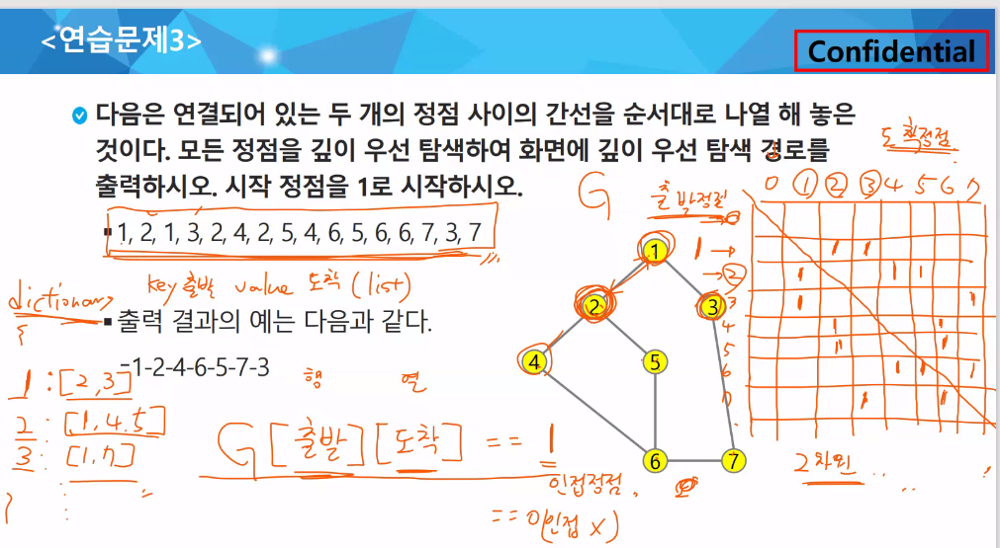

## Stack1

### 스택

자료구조란? 데이터를 효율적으로 저장하고 관리하기 위한 방법

Data : 프로그램 코드가 아닌 모든 것

데이터는 어떻게 컴퓨터에 저장될까? 스토리지 / 메모리

- 스토리지

  데이터가 영구적으로 저장되는 곳

  용량이 크지만 속도가 느림

  당장 필요한 데이터가 아닌 데이터

- 메모리

  데이터가 임시적으로 저장되는 곳

  용량이 작지만 속도가 매우 빠름

  당장 필요한 데이터가 위치

  데이터가 저장되는 위치 random

  RAM(random access memory)

→ 메모리를 효율적으로 사용하기 위해 데이터 구조 필요

데이터 타입(Data Type)

이 왜 필요할까? 다루는 데이터의 특성을 반영하기 위해

- 자료구조(선형/비선형)

  선형 자료구조(linear data structure): list, stack, queue, linked list

  비선형 자료구조: graph, tree

→ 데이터의 구조를 전체적으로 파악해서 효율적으로 사용가능

ADT(abstract data type)

추상화를 이용해서 자료구조를 표현해보자

- 스택(stack): 물건을 쌓아 올린 듯, 자료를 쌓아 올린 형태의 자료구조

  - 가장 마지막에 들어간 것이, 가장 처음에 나온다. (후입선출;LIFO)

  - `top`: 가장 위에 있는 것의 위치를 저장하는 변수

  - `pop`: 가장 위에 있는 것을 꺼냄

  - `push`: 새로운 데이터를 추가

    `append` 사용해서 추가 (시간이 오래걸림)

  ```python
  def push(item, size):
      global top
      # global 키워드는 global 변수를 사용해야할 때
      top += 1
      if top == size:
          # print('overflow!')(디버깅용)
      else:
          stack[top] = item
     
  size = 10
  stack = [0] * size
  top = -1
  
  push(10, size)
  top += 1
  stack[top]
  ```
  
  
  
  ex) 브라우저에 있는 뒤로 가기 버튼

>개발자들이 개발 관련해서 많이 찾아보는 사이트
>
>stack overflow

- 스택의 연산

  `CreateStack`: 스택을 생성하는 연산, size 필요

  `IsEmpty`: 스택이 현재 비어 있는지를 확인하는 연산

  `IsFull`:

- 스택의 데이터 구조

  `top`: 가장 위에 있는 위치를 저정하고 있는 데이터

  `size`: 스택의 크기를 저장하고 있는 데이터

  `itmes`: 스택에 담길 데이터를 저장할 데이터 구조

  저장소 자체를 스택이라 부르기도 한다

- 스택 응용1: 괄호검사

  오른쪽 괄호를 만나면 스택에서 top괄호를 삭제한 후 오른쪽 괄호와 짝 맞는지 검사,


### 재귀호출

- 자기 자신을 호출하여 순환 수행되는 것
- 함수에서 실행해야 하는 작업의 특성에 따라 일반적인 호출방식보다 재귀호출방식을 사용하여 함수를 만들면 프로그램의 크기를 줄이고 간단하게 작성
- 재귀를 이용한 배열 복사(재귀의 기본구조)

```python
def f(i, N):
    if i == N:
        print(B)
    else:
        B[i] = A[i]
        f(i+1, N)
    return
        
A = [10, 20, 30]
B = [0] * 3
f(0, 3)
```


### Memoization & DP

- 메모이제이션은 이전에 계산한 값을 메모리에 저장해서 매번 다시 계산하지 않도록하여 실행속도를 빠르게 하는 기술. 동적 계획법의 핵심이 되는 기술

- 피보나치 수를 구하는 알고리즘에서 fibo(n)의 값을 계산하자마자 저장하면(memoize), 실행시간을 줄일 수 있다

```python
def fibo(n):
    if n >= 2 and memo[n] == 0:
        memo[n] = fibo(n-1) + fibo(n-2)
    return memo[n]

N = 10
memo = [0] * (N+1)
memo[0] = 0
memo[1] = 1
print(fibo(N))
print(memo)
```

- DP(Dynamic Programming)

  동적 계획 알고리즘은 그리디 알고리즘과 같이 **최적화 문제**를 해결하는 알고리즘이다.

  동적 계획 알고리즘은 먼저 입력 크기가 작은 부분 문제들을 모두 해결한 후에 그 해들을 이용하여 보다 큰 크기의 부분 문제들을 해결하여, 최종적으로 원래 주어진 입력의 문제를 해결하는 알고리즘이다.

- 피보나치수의 DP 적용

  결과는 테이블에 저장하고, 테이블에 저장된 부분 문제의 해를 이용하여 상위 문제의 해를 구한다.

  ```python
  def fibo2(n):
      f = [0, 1]
      
      for i in range(2, n + 1):
          f.append(f[i-1] + f[i-2])
          
      return f[n]
  ```

  

### DFS(깊이우선탐색)

비선형 구조인 그래프 구조는 그래프로 표현된 모든 자료를 빠짐없이 검색하는 것이 중요하다

- 깊이 우선 탐색(Depth First Search, DFS) : 재귀 / 반복문(stack)

  - 시작점의 한 방향으로 갈 수 있는 경로가 있는 곳까지 깊이 탐색해 가다가 더 이상 갈 곳이 없게 되면, 가장 마지막에 만났던 갈림길이 있는 정점으로 되돌아와서 다른 방향의 정점으로 탐색을 계속 반복하여 결국 모든 정점을 방문하는 순회방법

  - 가장 마지막에 만났던 갈림길의 정점으로 되돌아가서 다시 깊이 우선 탐색을 반복해야 하므로 후입선출 구조의 스택 사용

  - 재귀 / **반복문(스택)** 이용

  인접 정점을 나타내는 방법(표, 딕셔너리, 리스트)

  

  - 알고리즘 순서

    시작 정점v를 결정하여 방문

    → 정점 v에 인접한 정점 중에서 방문하지 않은 정점 w이 있으면 정점 v를 스택에 push하고 정점 w를 방문. 그리고 w를 v로 하여 다시 반복 / 방문하지 않은 정점이 없으면, 탐색의 방향을 바꾸기 위해서 스택을 pop하여 받은 가장 마지막 방문 정점을 v로 하여 다시 반복

    → 스택이 공백이 될 때까지 반복

  

- 너비 우선 탐색(Breadth First Search; BFS)

