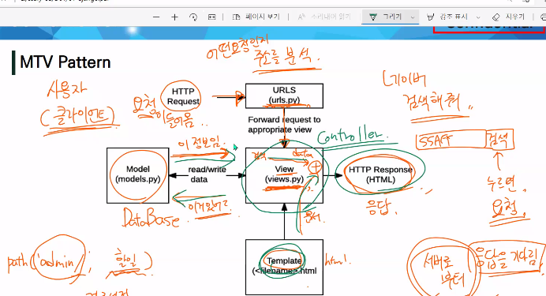

# Django

### Web framework

클라이언트 ;웹브라우저(크롬) → 서버(요청)

서버 ;django → 클라이언트(응답)

- Static web page(정적 웹 페이지)

  서버에 미리 저장된 파일이 사용자에게 그대로 전달되는 웹 페이지

  추가적인 처리 과정 없이 클라이언트에게 응답을 보냄

  모든 상황에서 모든 사용자에게 동일한 정보를 표시

- Dynamic web page(동적 웹 페이지)

  요청을 받은 경우 추가적인 처리 과정 이후 클라이언트에게 응답을 보냄

  방문자와 상호작용하기 때문에 페이지 내용은 그때그때 다름

  서버 사이드 프로그래밍 언어(Python, Jave, C++ 등)가 사용되며, 파일을 처리하고 데이터베이스와의 상호작용이 이루어짐

- Framework

  개발 환경, tool 제공

  프로그래밍에서 특정 운영 체제를 위한 응용 프로그램 표준 구조를 구현하는 클래스와 라이브러리 모임.

  재사용할 수 있는 수많은 코드를 프레임워크로 통합함으로써 개발자가 애플리케이션을 위한 표준 코드를 다시 작성하지 않아도 같이 사용할 수 있도록 도움.

  Application framework라고도 함

- Web framework 목적

  웹 페이지를 개발하는 과정에서 겪는 어려움을 줄이는 것이 주 목적
  
  데이터베이스 연동, 템플릿 형태의 표준, 세션 관리, 코드 재사용 등

- Django를 사용해야하는 이유

  검증된 Python 언어 기반 Web framework

  대규모 서비스에도 안정적이며 오랫동안 세계적인 기업들에 의해 사용됨

- Framework 구조

  MVC Design Pattern(model-view-controller)

  Django는 **MTV Pattern**이라고 함(특별한 의미없음, 더 잘 맞는 것 같아서)

- MTV Pattern⭐

  Model

  : 응용프로그램의 데이터 구조를 정의하고 데이터베이스의 기록을 관리(추가, 수정, 삭제)

  Template

  : 파일의 구조나 레이아웃 정의, 실제 보여지는 부분(presentation)

  View⭐

  : HTTP 요청을 수신하고 HTTP응답을 반환, template에게 응답의 서식 설정을 맡김

  

  

> 정리

### Django Intro

URL → VIEW → TEMPLATE (데이터의 흐름)

1.  가상환경 생성 및 활성화

   `python -m venv venv`

   `source venv/Scripts/activate`

   `pip install (-r) requirements.txt`

2.  django 설치

​	`pip install django==3.2`

​	`pip freeze > requirements.txt`

3.  프로젝트 생성

​	⭐프로젝트 생성 명령어

​	`$ django-admin startproject firstpjt .`

4.  서버 켜서 로켓 확인

​	`python manage.py runserver`

5.  앱 생성

   ` python manage.py startapp articles`

6.  앱 등록

7.  (장고pjt 생성 완료)프로젝트 폴더 바로 아래에 templates라는 폴더 생성

8.  settings.py에 TEMPLATES에 있는 DIRS 리스트에 templates경로 등록

9.  base.html을 생성하고 꾸민다

​	(git으로 관리할 때는 venv는 커밋하지 않기. requirements.txt만 커밋)

- 프로젝트 구조

  settings.py : 애플리케이션의 모든 설정 포함

  **urls.py** : 사이트의 url과 적절한 views의 연결 지정

  위 두 개의 파일만 터치(다른 파일은 터치할 일 없음)

- Application 생성

  일반적으로 application명은 복수형으로 하는 것을 권장

  `$ python manage.py startapp articles`

- Application 구조

  admin.py : 관리자용 페이지를 설정하는 곳

  models.py : 앱에서 사용하는 model을 정의하는 곳

  views.py : view 함수들이 정의되는 곳

  위 세 개의 파일만 터치

- **Project & Application**

  - Project

    앱의 집합

    프로젝트에는 여러 앱이 포함될 수 있음

    앱은 여러 프로젝트에 있을 수 있음(이 단계까지 넓히지 않음)

  - Application

    앱은 실제 요청을 처리하고 페이지를 보여주고 하는 등의 역할을 담당

    하나의 프로젝트는 여러 앱을 가짐

- 앱 등록

  프로젝트에서 앱을 사용하기 위해서는 반드시 INSTALLED_APPS 리스트에 추가해야함

※ 반드시 생성 후 등록! INSTALLED_APPS에 먼저 등록하고 생성하려면 앱이 생성되지 않음

※ django가 권장하는 앱 등록 순서가 있음. 해당 순서를 지키지 않아도 수업 과정에서는 문제가 없지만, 추후 advanced한 내용을 대비하기 위해 지키는 것을 권장(로딩순서, 가장 위에 있을수록 우선 로딩)

### 요청과 응답

- URLs

  HTTP 요청을 알맞은 view로 전달

- View

  HTTP 요청을 수신하고 HTTP 응답을 반환하는 함수 작성

  함수의 인자는 request로 지정(요청정보) (약속!)

  함수의 return으로 render() (사용자에게 응답 결과 전달)

- Templates

  반드시 앱 폴더 내부에 'templates'폴더 내부에 html 파일이 있어야함

- LANGUAGE_CODE: 영어로 쓰는 것 권장

### Template

- Django Template Language(**DTL**)

  Django template에서 사용하는 built-in template system

  조건, 반복, 변수 치환, 필터 등의 기능 제공

  단순히 Python이 HTML에 포함된 것이 아니며, 프로그래밍적 로직이 아니라 프레젠테이션을 표현하기 위한 것

  Python처럼 일부 프로그래밍 구조(if, for 등)를 사용할 수 있지만, 이것은 해당 python 코드로 실행되는 것이 아님

- DTL Syntax

  1. Variable

     render()를 사용하여 view.py에서 정의한 변수를 template파일로 넘겨 사용하는 것

     render()안의 변수명은 context로 지정(관행적 약속)

     render()의 세번째 인자로 {'key': value}와 같이 딕셔너리 형태로 넘겨주며 여기서 해당하는 문자열이 template에서 사용 가능한 변수명이 됨

  2. Filters

     표시할 변수를 수정할 때 사용

     여러 개의 필터 chained가 가능하며 일부 필터는 인자를 받기도 함

  3. Tags

     

     출력 텍스트를 만들거나 반복 또는 논리를 수행하여 제어 흐름을 만듬

     변수보다 복잡한 일 수행

     일부 태그는 시작과 종료 태그 필요(범위 지정이 있는 for문...)

     > https://docs.djangoproject.com/en/3.2/ref/templates/builtins/
     >
     > ⭐for문 파트 읽어보기

  4. Comments

     {# 내용 #} : 한줄 주석에만 사용

     ctrl + ' / ': 여러 줄 주석에 사용

- Template inheritance(템플릿 상속)

  - tags

    

    :자식(하위)템플릿이 부모 템플릿을 확장한다는 것을 알림

    반드시 템플릿 최상단에 작성

     

    : 하위 템플릿에서 재지정할 수 있는 블록을 정의(즉, 하위 템플릿이 채울 수 있는 공간)

    

    : 템플릿을 로드하고 현재 페이지로 렌더링, 템플릿 내에 다른 템플릿을 포함하는 방법

> 코드 작성 순서!
>
> urls.py → views.py → templates

### HTML Form

- form

  사용자로부터 입력받은 데이터를 서버로 전송하는 역할을 담당

  핵심 속성: `action`(전달된 서버주소), `method`(입력 데이터 전달 방식 지정)

- input

  사용자로부터 데이터를 입력받기 위해 사용

  type 속성에 따라 동작 방식이 달라짐(radio, checkbox, ...)

  핵심 속성: `name`

- label

  label을 input과 연결(label을 클릭했을 때 input에 포커싱이 가도록)

- for

- HTTP

  웹에서 이루어지는 모든 데이터 교환의 기초

  GET: 정보를 조회하는데 사용, 데이터를 가져올 때만 사용해야함

  데이터를 서버에 전송할 때 body가 아닌 Query String Parmneters를 통해 전송

  POST: 생성, 수정, 삭제

### URL

