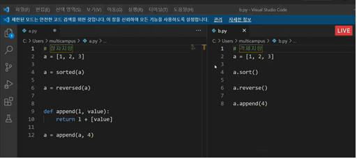

## OOP(Object Oriented Programming)

### 객체

파이썬은 모든 것이 객체(object)

객체는 특정 타입의 인스턴스(instance; 사례)

- 예시

  123, 900, 5는 모두 int의 인스턴스

  'hello', 'bye'는 모두 string의 인스턴스

- 객체의 특징

  - 타입(type): 어떤 연산자와 조작이 가능한가?

  - 속성(attribute): 어떤 상태(데이터)를 가지는가?

  - 조작법(method): 어떤 행위(함수)를 할 수 있는가?

### 객체지향 프로그래밍(OOP)

객체지향 프로그래밍이란? 

<=> 절차지향 프로그래밍(데이터와 함수로 인한 변화)

- 객체로 나누어져 있다
- 데이터와 기능(메소드) 분리, 추상화된 구조(인터페이스)

​    

- 사각형 - 클래스(class)⭐

- 각 사각형(R1, R2) - 인스턴스(instance)

- 사각형의 정보 - 속성(attribute)(가로 길이, 세로 길이)

- 사각형의 행동 - 메소드(넓이를 구한다, 높이를 구한다)

- 객체지향 프로그래밍이 필요한 이유

  현실 세계를 프로그램 설계에 반영(추상화)

- 장점(코드의 직관성, 용이성, 유연성)

  객체 지향 프로그래밍은 프로그램을 유연하고 변경이 용이하게 만들기 때문에 대규모 소프트웨어 개발에 많이 사용된다.

  또한, 프로그래밍을 더 배우기 쉽게 하고 소프트웨어 개발과 보수를 간편하게 하며, 보다 직관적인 코드 분석을 가능하게 하는 장점을 가지고 있다.


### OOP 기초

- 기본 문법⭐

  - 클래스 정의

    class MyClass:

  - 인스턴스 생성

    my_instance = MyClass()

  - 속성 접근

    my_instance.my_attribute

  - 메서드 호출

    my_instance.my_method()

- 클래스
  - 공통된 속성과 조작법을 가진 객체들의 분류
  - 단어의 첫 글자는 대문자로 작성

- 객체 비교하기

  - ==
  - is : 두 변수가 동일한 객체를 가리키는 경우 True

  

- 인스턴스 변수⭐

  인스턴스들의 고유한 변수

  인스턴스가 생성된 이후 `<instance>.<name>`으로 접근 및 할당

- 인스턴스 메소드⭐

  호출 시, 첫 번째 인자로 **인스턴스 자기자신(self)이 전달됨**(다른 단어로 써도 작동하지만 파이썬의 암묵적 규칙)

- self⭐

  인스턴스 자기자신(다른 이름도 가능하지만 권장x)

- 생성자 메소드⭐

  인스턴스 객체가 생성될 때 자동으로 호출되는 메소드

  인스턴스 변수들의 초기값을 설정: `_init_`메소드 자동 호출

- 소멸자 메서드

  인스턴스 객체가 소멸되기 직전에 자동으로 호출되는 함수

  `__del__`이라는 이름으로 정의

- 매직 메소드

  - Double underscore(__)가 있는 메소드는 특수한 동작을 위해 만들어진 메소드로, 스페셜 메소드 혹은 매직 메소드라고 불림

    `__str__`: 해당 객체를 출력(print)할 때 보여줄 내용을 정의

 

### 클래스

- 클래스 변수⭐

  - 한 클래스의 모든 인스턴스가 똑같은 값을 가지고 있는 속성
  - 클래스 이름 대신 인스턴스 이름을 쓰면? 인스턴스 변수

- 클래스 메소드

  - 클래스를 조작하고 싶어
  - 메스드 호출 시, 첫 번째 인자로 cls 전달

  - `@classmethod` 데코레이터를 사용하여 정의

- 인스턴스 메소드
  - 왠만한 메소드는 인스턴스 메소드(.sort())
  - 인스턴스를 조작하고 싶어
  - 함수 내부에 인스턴스를 던져주도록 설계
  - 메서드를 정의할 때 self로 받도록

- 인스턴스와 클래스 간의 이름공간⭐

  인스턴스에서 특정 속성에 접근하려면, 인스턴스 > 클래스 순으로 탐색

- 스태틱 메소드⭐

  - 클래스나 인스턴스를 조작할 생각은 없는데 함수를 쓸거야

  - 클래스가 사용할 메소드에 해당
  - `@staticmethod` 데코레이터 사용하여 정의
  - 호출 시, 어떠한 인자도 전달되지 않음


### ⭐메소드 정리

- 인스턴스 메소드

  인스턴스에서 클래스 메서드와 스태틱 메서드는 호출하지 않는다

- 클래스 메소드

  클래스에서 인스턴스 메서드는 호출하지 않는다

  클래스 자체(cls)와 그 속성에 접근할 필요가 있다면 클래스 메서드로 정의

  접근할 필요가 없다면 정적 메서드로 정의

- 스태틱 메소드

  유틸리티적인 부분들에서 사용

  주로 해당 클래스로 한정하는 용도로 사용(클래스에 종속)

### OOP의 핵심개념

- 객체지향의 핵심 4가지

  - 추상화

    세부적인 내용은 감추고 필수적인 부분만 표현하는 것을 의미

    

  - 상속⭐

    클래스는 상속이 가능함

    모든 클래스는 객체(object)를 상속받음

    상속을 통한 메소드 재사용

    - 상속 관련 함수와 메소드

      `issubclass(class, classinfo)`: class가 classinfo의 subclass인 경우 True 반환

      `isinstance(object, classinfo)`: object가 calssinfo의 인스턴스거나 subclass인 경우 True 반환

      ⭐`super()`:  자식 클래스에 메소드를 추가 구현

      

  - 다형성

    다형성(polymorphism)이란?

    동일한 메소드가 클래스에 따라 다르게 행동할 수 있음

    동일한 메시지에 대해 다른 방식으로 응답될 수 있음

    - 메소드 오버라이딩⭐: 자식 클래스에서 부모 클래스의 메서드를 재정의

    

  - 캡슐화

    암묵적으로 존재하지만, 언어적으로는 존재하지 않음

    - 접근제어자 종류
  
      Public Access Modifier: 언더바 없이 시작하는 메서드나 속성들, 어디서나 호출 가능
  
      Protected Access Modifier: 언더바 1개로 시작, 암묵적 규칙으로 부모 클래스와 자식 클래스 내부에서만 사용 가능
  
      Private Access Modifier: 언더바 2개로 시작, 외부 호출 불가능, 하위 클래스 상속 및 호출 불가능
  
      
    
    - getter 메소드와 setter 메소드
    
      변수에 접근할 수 있는 메서드를 별도 생성
    
      `getter`: 변수의 값을 읽는 메서드, `@property`데코레이터 사용
    
      `setter`: 변수의 값을 설정하는 성격의 메서드, `@변수.setter` 사용
    
      
    
    - 다중 상속⭐
    
      두 개 이상의 클래스를 상속받는 경우, 다중 상속이 됨
    
      중복된 속성이나 메서드가 있는 경우 상속 순서에 의해 결정
    
    - 상속관계에서의 이름 공간과 MRO(method resolution order)
    
      인스턴스 > 자식 클래스 > 부모 클래스 순으로 이름 공간 탐색
    
      ```
      .__mro__
      .mro()
      # 해당 인스턴스의 클래스가 어떤 부모 클래스를 가지는지 확인하는 속성 또는 메서드
      ```