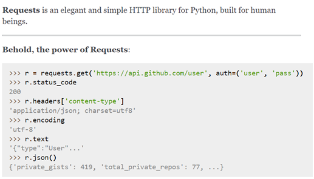
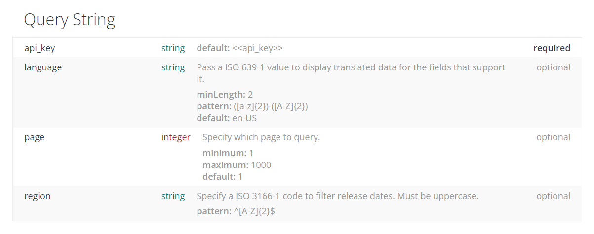

## 웹 스크래핑(크롤링)


- 요청과 응답

  HTTP(프로토콜; 약속)

  요청(클라이언트)과 응답(서버): 요청할 때는 url로, 문서(HTML, JSON)로 응답

  =>파이썬을 통해 주소로 요청을 보내고, 응답 결과를 파이썬으로 조작해보자!


- requests

  

  ```python
  # 웹 사이트의 정보를 가지고 오고 싶다.
  import requests
  from bs4 import BeauifulSoup
  
  # 1-1. 주소
  URL = https://finance.naver.com/sise/
  
  # 1-2. 요청
  # https://docs.python-requests.org/en/latest/user/quickstart/#make-a-request
  # response (200) <= 성공적으로 가져왔다
  response = requests.get(URL).text
  print(response)   #print(type(response))  string
  
  # 2-1. BeauifulSoup (text -> 다른 객체)
  # Beautiful Soup is a Python library for pulling data out of HTML and XML files.  HTML 파일에 있는 데이터를 가져오기 위해 활용
  data = BeatifulSoup(response, 'html.parser')
  print(type(data), type(response))  # bs4.BeauifulSoup  str
  
  # 2-2. 내가 원하는 정보를 찾는다.
  kospi = data.select_one('#KOSPI_now')
  print(kospi.text)
  ```

  

- BeautifulSoup

  HTML에 있는 문서를 가져오는 라이브러리


## API

- JSON

  json viewer 설치

- API(Application Programming Interface)

  컴퓨터나 컴퓨터 프로그램 사이의 연결

  일종의 소프트웨어 인터페이스이며 다른 종류의 소프트웨어에 서비스를 제공

  사용하는 방법을 기술하는 문서나 표준은 API 사양/명세

  

API 명세서에서 어떤 정보를 확인해야할까?

- API 활용하는 법

  요청하는 방식에 대한 이해

  - URL 생성
  - 원하는 기능헤 대한 추가 경로
  - 요청 변수(필수와 선택)

  응답 결과에 대한 이해

  - 응답 결과 타입(JSON)
  - 응답 결과 구조

```python
# 1. URL
# 요청 변수 : ?name=michael
# URL = https://api.agify.io/?name=michael
URL = https://api.agify.io
params = {
    'name': 'michael'
}

# for name in ['tom', 'john', 'jane']
# URL = https://api.agify.io
# params = {
#    'name': 'michael'
# }

# 2. 요청
response = requests.get(URL, params=params).json()
print(response)
print(response.get('age'))
```

- TMDB 실습



```python
import requests
# 1. URL 및 요청변수 설정
# https://api.themoviedb.org/3/movie/now_playing?api_key=570c19144ee85ad2b480f43c5ccac57f&region=KR&language=ko
# http로 요청보낼거야, 
BASE_URL = 'https://api.themoviedb.org/3'
path = '/movie/now_playing'
params = {
    'api_key' : '570c19144ee85ad2b480f43c5ccac57f'
    'region' : 'KR'
    'language' : 'ko'
}

# 2. 요청 보낸 결과 저장
response = requests.get(BASE_URL+path, params=params)
print(response.status_code, response.url)
data = response.json()
print(type(data.get('result'))) # list
pprint(data.get('result')[0]) # list 첫번째 구조
print(type(data.get('result')[0])) # dict

# 3. 조작
print(response)
```

