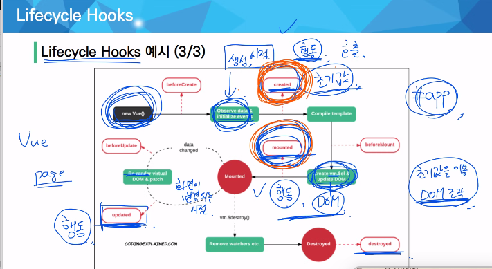

# Vue 01 (22.05.04)

## Intro

p. 68 오타

hidden → none

function자리에 화살표함수가 들어가면 안되지만 function 안에 화살표함수가 들어가는건 function의 this를 그대로 물려받기때문에 사용이 가능합니다

물려받기보다는 화살표함수에 this자체가 없어서 상위 함수의 this 를 찾아간다는 느낌

watch

사용할 일 x

