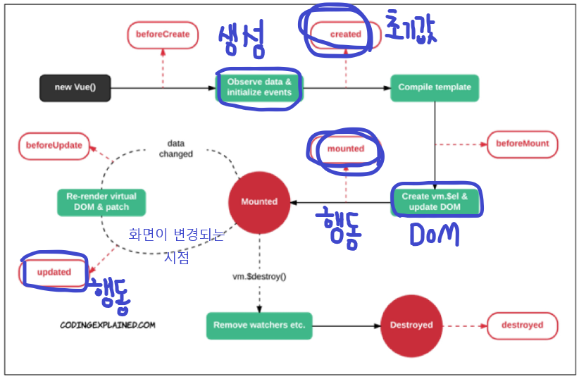

# Vue 01 (22.05.04)

## Intro

- Vue.js

  사용자 인터페이스를 만들기 위한 진보적인 자바스크립트 프레임워크

  현대적인 tool과 다양한 라이브러리를 통해 SPA(Single Page Application)를 완벽하게 지원

- **SPA**(Single Page Application; 단일 페이지 애플리케이션)

  현재 페이지를 동적으로 렌더링함으로써 사용자와 소통하는 웹 애플리케이션

  단일 페이지로 구성되며 서버로부터 최초에만 페이지를 다운로드하고, 이후에는 동적으로 DOM을 구성

  - 처음 페이지를 받은 이후부터는 서버로부터 새로운 전체 페이지를 불러오는 것이 아닌, 현재 페이지 중 필요한 부분만 동적으로 다시 작성함

  연속되는 페이지 간의 사용자 경험(UX)을 향상

  - 모바일 사용량이 증가하고 있는 현재, 트래픽 감소와 속도, 사용성, 반응성의 향상은 매우 중요하기 때문

  동작 원리의 일부가 CSR(Client Side Rendering)의 구조를 따름

- SPA 등장 배경

  과거 웹 사이트들은 요청에 따라 매번 새로운 페이지를 응답하는 방식이었음

  - MPA(Multi Page Application)

  스마트폰이 등장하면서 모바일 최적화의 필요성이 대두됨

  이러한 문제를 해결하기 위해 Vue.js와 같은 프론트엔드 프레임워크가 등장

  - CSR, SPA의 등장

  1개의 웹 페이지에서 여러 동작이 이루어지며 모바일 앱과 비슷한 형태의 사용자 경험을 제공

- **CSR**(Client Side Rendering)

  서버에서 화면을 구성하는 SSR 방식과 달리 클라이언트에서 화면을 구성

  최초 요청 시 HTML, CSS, JS 등 데이터를 제외한 각종 리소스를 응답받고 이후 클라이언트에서는 필요한 데이터만 요청해 JS로 DOM을 렌더링하는 방식

  즉, 처음엔 뼈대만 받고 브라우저에서 동적으로 DOM을 그림

  SPA가 사용하는 렌더링 방식

  - **장점**

    1. 서버와 클라이언트 간 트래픽 감소

       웹 애플리케이션에 필요한 모든 정적 리소스를 최초에 한 번 다운로드 후 필요한 데이터만 갱신

    2. 사용자 경험(UX) 향상

       전체 페이지를 다시 렌더링하지 않고 변경되는 부분만을 갱신하기 때문

  - **단점**

    1. SSR에 비해 전체 페이지 최종 렌더링 시점이 느림
    2. SEO(검색 엔진 최적화)에 어려움이 있음(최초 문서에 데이터 마크업이 없기 때문)

- **SSR**(Server Side Rendering)

  서버에서 클라이언트에게 보여줄 페이지를 모두 구성하여 전달하는 방식

  JS 웹 프레임워크 이전에 사용되던 전통적인 렌더링 방식

  - **장점**

    1. 초기 구동 속도가 빠름

       클라이언트가 빠르게 컨텐츠를 볼 수 있음

    2. SEO(검색 엔진 최적화)에 적합

       DOM에 이미 모든 데이터가 작성되어 있기 때문

  - **단점**

    모든 요청마다 새로운 페이지를 구성하여 전달

    - 반복되는 전체 새로고침으로 인해 사용자 경험이 떨어짐
    - 상대적으로 트래픽이 많아 서버의 부담이 클 수 있음

- SSR & CSR

  - 두 방식의 차이는 최종 HTML 생성 주체가 누구인가에 따라 결정
  - 즉, 실제 브라우저에 그려질(렌더링) HTML을 서버가 만든다면 SSR/클라이언트가 만든다면 CSR

  - SSR과 CSR을 단순 비교하여 '어떤 것이 더 좋다'가 아니라, 내 서비스 또는 프로젝트 구성에 맞는 방법을 적절하게 선택하는 것이 중요

  - 예를 들어, Django에서 Axios를 활용한 좋아요/팔로우 로직의 경우 대부분은 Server에서 완성된 HTML을 제공하는 구조(SSR)

  - 단, 특정 요소(좋아요/팔로우)만 JS(AJAX & DOM 조작)를 활용(CSR)

    AJAX를 활용해 비동기 요청으로 필요한 데이터를 클라이언트에서 서버로 직접 요청을 보내 받아오고 JS를 활용해 DOM을 조작

- [참고]SEO

  웹 페이지 검색엔진이 자료를 수집하고 순위를 매기는 방식에 맞게 웹 페이지를 구성해서 검색 결과의 상위에 노출될 수 있도록 하는 작업

  인터넷 마케딩 방법 중 하나

  구글의 등장 이후 검색엔진들이 컨텐츠의 신뢰도를 파악하는 기초 지표로 사용됨

  (다른 웹 사이트에서 얼마나 인용되었나를 반영)

## Why Vue.js ?

- 왜 사용할까?

  현대 웹 페이지는 페이지 규모가 계속해서 커지고 있으며, 그만큼 사용하는 데이터도 늘어나고 사용자와의 상호작용도 많이 이루어짐

  결국 Vanilla JS만으로는 관리하기가 어려움

  → 페이스북이 React를 개발한 이유

- 비교

  - Vanilla JS

    한 유저가 작성한 게시글이 DOM 상에 100개 존재

    이 유저가 닉네임을 변경하면, DB의 Update와 별도로 DOM상의 100개의 작성자 이름이 모두 수정되어야함

    '모든 요소'를 선택해서 '이벤트'를 등록하고 값을 변경해야함

  - Vue.js

    DOM과 Data가 연결되어 있고 Data를 변경하면 이에 연결된 DOM은 알아서 변경

    즉, 우리가 신경써야할 것은 오직 Data에 대한 관리**(Developer Exp 향상)**

## Concepts of Vue.js

- MVVM Pattern

  애플리케이션 로직을 UI로부터 분리하기 위해 설계된 디자인 패턴

  구성요소

  1. Model
  2. View
  3. View Model

  

  - **Model**

    "Vue에서 Model은 JavaScript Object이다."

    Object === { key:value }

    Model은 Vue Instance 내부에서 data라는 이름으로 존재

    이 data가 바뀌면 View(DOM)가 반응

  - **View**

    "Vue에서 View는 DOM(HTML)이다."

    Data의 변화에 따라서 바뀌는 대상

  - **View Model**

    "Vue에서 ViewModel은 모든 Vue Instance이다."

    View와 Model 사이에서 Data와 DOM에 관련된 모든 일을 처리

    ViewModeld을 활용해 Data를 얼마만큼 잘 처리해서 보여줄 것인지(DOM)를 고민하는 것

## ⭐Quick Start of Vue.js

- Django & Vue.js 코드 작성 순서

  - Django

    "데이터의 흐름"

    url → views → template

  - Vue.js

    "Data가 변화하면 DOM이 변경"

    Data 로직 작성 → DOM 작성

- 공식문서의 '시작하기' 따라하기

  CDN 작성

  선언적 렌더링

  Element 속성 바인딩

  조건문

  반복문

  사용자 입력 핸들링

## Basic syntax of Vue.js

- Vue instance

  모든 Vue 앱은 Vue 함수로 새 인스턴스를 만드는 것부터 시작

  Vue 인스턴스를 생성할 때는 Options 객체를 전달해야함

  여러 Options들을 사용하여 원하는 동작을 구현

  Vue Instance === Vue Component

- Options/Dom - 'el'

  Vue 인스턴스에 연결(마운트)할 기존 DOM 요소가 필요

  CSS 선택자 문자열 혹은 HTML Element로 작성

  new를 이용한 인스턴스 생성 때만 사용

- Options/Dom - 'data'

  Vue 인스턴스의 데이터 객체

  Vue인스턴스의 상태 데이터를 정의하는 곳

  Vue template에서 interpolation을 통해 접근 가능

  v-bind, v-on과 같은 directive에서도 사용 가능

  Vue 객체 내 다른 함수에서 this 키워드를 통해 접근 가능

- Options/Dom - 'methods'

  Vue 인스턴스에 추가할 메서드

  Vue template에서 interpolation을 통해 접근 가능

  v-on과 같은 directive에서도 사용 가능

  Vue 객체 내 다른 함수에서 this 키워드를 통해 접근 가능

  - 주의

    **화살표 함수를 메서드를 정의하는데 사용하면 안됨**

    화살표 함수가 부모 context를 바인딩하기 때문에, 'this'는 Vue 인스턴스가 아님

    > function 자리에 화살표 함수가 들어가면 안되지만 function 안에 화살표 함수를 사용하기도함
    >
    > (화살표 함수에 this자체가 없어서 상위 함수의 this 를 찾아가는 느낌)

## ⭐Template Syntax

- 렌더링 된 DOM을 기본 Vue 인스턴스의 데이터에 선언적으로 바인딩할 수 있는 HTML 기반 템플릿 구문을 사용

  1. Interpolation
  2. Directive

- Interpolation(보간법)

  1. Text

     `메시지: {{ msg }}`

  2. Raw HTML

     ``

  3. Attributes

     `

`

  4. JS 표현식

     `{{ number + 1 }}`

     `{{ message.split('').reverse().join('') }}`

- Directive(디렉티브)

  v- 접두사가 있는 특수 속성

  속성 값은 단일 JS 표현식이 됨(v-for는 예외)

  표현식의 값이 변경될 때 반응적으로 DOM에 적용하는 역할을 함

  - 전달인자(Arguments)

    `:`(콜론)을 통해 전달인자를 받을 수도 있음

  - 수식어(Modifiers)

    `.`(점)으로 표시되는 특수 접미사

    directive를 특별한 방법으로 바인딩해야함을 나타냄

- v-text

  엘리먼트의 textContent를 업데이트

  내부적으로 interpolation 문법이 v-text로 컴파일됨

- v-html

  엘리먼트의 innerHTML을 업데이트(XSS 공격에 취약할 수 있음)

  임의로 사용자로부터 입력받은 내용은 v-html에 **절대 사용 금지**

- v-show

  조건부 렌더링 중 하나

  요소는 항상 렌더링되고 DOM에 남아있음

  단순히 엘리먼트에 display CSS속성을 토글하는 것

- v-if, v-else-if, v-else

  조건부 렌더링 중 하나

  조건에 따라 요소를 렌더링

  directive의 표현식이 true일 때만 렌더링

  엘리먼트 및 포함된 directive는 토글하는 동안 삭제되고 다시 작성됨

- **v-show와 v-if**

  - v-show (Expensive initial load, cheap toggle)

    CSS display 속성을 none으로 만들어 토글

    실제로 렌더링은 되지만 눈에서 보이지 않는 것이기 때문에 딱 한 번만 렌더링이 되는 경우라면 v-if에 비해 상대적으로 렌더링 비용이 높음

    하지만, 자주 변경되는 요소라면 한 번 렌더링 된 이후부터는 보여주는지에 대한 여부만 판단하면 되기 때문에 토글 비용이 적음

  - v-if (Cheap initial load, expensive toggle)

    전달인자가 false인 경우 렌더링 되지 않음

    화면에서 보이지 않을 뿐만 아니라 렌더링 자체가 되지 않기 때문에 렌더링 비용이 낮음

    하지만, 자주 변경되는 요소의 경우 다시 렌더링해야하므로 비용이 증가할 수 있음

- v-for

  원본 데이터를 기반으로 엘리먼트 또는 템플릿 블록을 여러 번 렌더링

  item in items 구문 사용

  item 위치의 변수를 각 요소에서 사용할 수 있음(객체의 경우는 key)

  v-for 사용 시 반드시 key 속성을 각 요소에 작성

  v-if와 함께 사용하는 경우 v-for가 우선순위가 더 높음(단, 가능하다면 함께 사용하지 말 것)

- v-on

  엘리먼트에 이벤트 리스너를 연결

  이벤트 유형은 전달인자로 표시함

  특정 이벤트가 발생했을 때, 주어진 코드가 실행됨

  약어(shorthand): `@`

- v-bind

  HTML 요소의 속성에 Vue의 상태 데이터를 값으로 할당

  Object 형태로 사용하면 value가 true인 key가 class 바인딩 값으로 할당

  약어(shorthand): `:`

- v-model

  HTML form 요소의 값과 data를 양방향 바인딩(HTML의 input요소와 data를 한몸으로 만들어버림)

  수식어

  - .lazy

    input 대신 change 이벤트 이후에 동기화

  - .number

    문자열을 숫자로 변경

  - **.trim**

    입력에 대한 trim을 진행

- Options/Data - 'computed'⭐

  데이터를 기반으로 하는 계산된 속성

  함수의 형태로 정의하지만 함수가 아닌 함수의 반환 값이 바인딩됨(반드시 반환값이 있어야함)

  종속된 데이터에 따라 저장(캐싱)됨

  종속된 데이터가 변경될 때만 함수 실행

  즉, 어떤 데이터에도 의존하지 않는 computed 속성의 경우 절대로 업데이트되지 않음

- **computed & methods**

  computed 속성 대신 methods에 함수를 정의할 수도 있음

  (최종 결과에 대해 두 가지 접근 방식은 동일)

  차이점은 computed 속성은 종속 대상을 따라 저장(캐싱)됨

  즉, computed는 종속된 대상이 변경되지 않는 한 computed에 작성된 함수를 여러 번 호출해도 계산을 다시 하지 않고 계산되어 있던 결과를 반환

  이에 비해 methods를 호출하면 렌더링을 다시 할 때마다 항상 함수를 실행

> methods : data를 바꾸는 로직 위주(setter 함수들)
>
> computed : data를 통한 값을 얻음(getter 함수들)

- Options/Data - 'watch'

  데이터를 감시

  데이터에 변화가 일어났을 때 실행되는 함수

- **computed & watch**

  - computed

    특정 데이터를 직접적으로 사용/가공하여 다른 값으로 만들 때 사용

    속성은 계산해야 하는 목표 데이터를 정의하는 방식으로 '선언형 프로그래밍' 방식

    "특정 값이 변동하면 해당 값을 다시 계산해서 보여준다"

  - watch

    특정 데이터의 변화 상황에 맞춰 다른 data 등이 바뀌어야 할 때 주로 사용

    감시할 데이터를 지정하고 그 데이터가 바뀌면 특정 함수를 실행하는 방식

    '명령형 프로그래밍' 방식

    "특정 값이 변동하면 다른 작업을 한다"

  > computed와 watch는 어떤 것이 더 우수한 것이 아닌 사용하는 목적과 상황이 다름
  >
  > Vue에서 우리가 선호하는 것은 선언형
  >
  > watch 거의 쓰지 않음, computed 사용

- Options/Assets - 'filter'

  텍스트 형식화를 적용할 수 있는 필터

  interpolation 혹은 v-bind를 이용할 때 사용 가능

  필터는 표현식 마지막에 `|`(파이프)와 함께 추가되어야 함

  이어서 사용(chaining) 가능

## ⭐Lifecycle Hooks

- 각 Vue 인스턴스는 생성될 때 일련의 초기화 단계를 거침

  (예를 들어, 데이터 관찰 설정이 필요한 경우, 인스턴스를 DOM에 마운트하는 경우, 데이터가 변경되어 DOM을 업데이트하는 경우 등)

- 그 과정에서 사용자 정의 로직을 실행할 수 있는 Lifecycle Hooks도 호출됨

- 공식문서를 통해 각 라이프사이클 훅의 상세 동작을 참고

