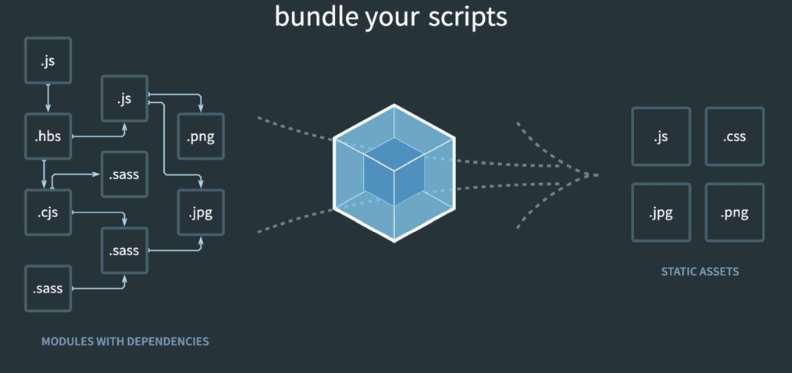

# Vue 02 (22.05.09)

### SFC

- Component(컴포넌트)

  기본 HTML 엘리먼트를 확장하여 재사용 가능한 코드를 캡슐화하는데 도움을 줌

  CS에서는 다시 사용할 수 있는 범용성을 위해 개발된 소프트웨어 구성 요소를 의미

  즉, 컴포넌트는 유지보수를 쉽게 만들어 줄 뿐만 아니라, 재사용성의 측면에서도 매우 강력한 기능을 제공

  각 component는 페이지를 구성하는 block같은 존재

  **Vue 컴포넌트 === Vue 인스턴스**

  

- SFC(Single File Component)

  Vue의 컴포넌트 기반 개발의 핵심 특징

  하나의 컴포넌트는 .vue 확장자를 가진 하나의 파일 안에서 작성되는 코드의 결과물

  화면의 특정 영역에 대한 HTML, CSS, JavaScript 코드를 하나의 파일(.vue)에서 관리

  즉, .vue 확장자를 가진 싱글 파일 컴포넌트를 통해 개발하는 방식

  component폴더에서 만드는 vue파일명은 두단어 조합을 추천. 파스칼 케이스로 작성

  **Vue 컴포넌트 === Vue 인스턴스 === .vue 파일**

  

- Component 예시

  처음 개발을 시작할 때는 크게 신경쓸 것이 없기 때문에 쉽게 개발 가능

  하지만 코드의 양이 많아지면 변수 관리가 힘들어지고 유지보수에 많은 비용 발생

  ⇒ 각 기능 별로 파일을 나눠서 개발

  처음 개발을 준비하는 단계에서 시간 소요 증가, 하지만 이후 변수 관리가 용이하며 기능 별로 유지&보수 비용 감소

  

- Vue Component 구조 예시

  - 한 화명 안에서도 기능 별로 각기 다른 컴포넌트가 존재

    하나의 컴포넌트는 여러 개의 하위 컴포넌트를 가질 수 있음

    Vue는 컴포넌트 기반의 개발 환경 제공

  - Vue 컴포넌트는 const app = new Vue({...})의 app을 의미하며 이는 Vue인스턴스

    여기서 오해하면 안되는 것! 컴포넌트 기반의 개발이 반드시 파일 단위로 구분되어야하는 것은 아님

    단일 .html 파일 안에서도 여러 개의 컴포넌트를 만들어 개발 가능

> 정리
>
> Vue 컴포넌트는 Vue인스턴스(new Vue({ }))이기도 함
>
> Vue 인스턴스는 .vue 파일 안에 작성된 코드의 집합
>
> HTML, CSS, 그리고 JavaScript를 .vue라는 확장자를 가진 파일 안에서 관리하며 개발

### Vue CLI

- Vue CLI

  Vue.js 개발을 위한 표준 도구

  프로젝트의 구성을 도와주는 역할을 하며 Vue 개발 생태계에서 표준 tool 기준을 목표로 함

  확장 플러그인, GUI, Babel 등 다양한 tool 제공

- Node.js

  자바스크립트를 브라우저가 아닌 환경에서도 구동할 수 있도록 하는 자바스크립트 런타임 환경

  즉, 단순히 브라우저만 조작할 수 있던 자바스크립트를 SSR 아키텍처에서도 사용할 수 있도록 함

- NPM(Node Package Manage)

  자바스크립트 언어를 위한 패키지 관리자

  - Python에 pip가 있다면 Node.js에는 NPM

  Node.js의 기본 패키지 관리자

  Node.js 설치 시 함께 설치됨

- Vue CLI Start

  설치 - $ npm install -g @vue/cli   (-g는 global이라는 뜻으로 쓰라는 곳에만 쓰자)

  버젼 확인 - $ vue --version 혹은 $ vue -V

  프로젝트 생성 - $ vue create my-first-app

  Vue 버전 선택 - [Vue 2]

  프로젝트 디렉토리 이동 - $ cd my-first-app

  서버 실행 - npm run serve

### Babel & Webpack

- Babel

  자바스크립트의 ECMAScript 2015+ 코드를 이전 버전으로 번역/변환해주는 도구

  과거 자바스크립트의 파편화와 표준화의 영향으로 코드의 스펙트럼이 매우 다양. 이 때문에 최신 문법을 사용해도 이전 브라우저 혹은 환경에서 동작하지 않는 상황 발생

  원시 코드(최신 버전)를 목적 코드(구 버전)로 옮기는 번역기

  Babel 동작 예시(p. 28)

- Webpack

  "static module bundler"

  모듈 간의 의존성 문제를 해결하기 위한 도구

  프로젝트에 필요한 모든 모듈을 매핑하고 내부적으로 종속성 그래프를 빌드함

  - static **module** bundler

    모듈은 단지 파일 하나를 의미(ex. js파일 하나 === 모듈 하나)

    - 배경

      브라우저만 조작할 수 있었던 시기의 자바스크립트는 모듈 관련 문법 없이 사용됨

      하지만 JS와 애플리케이션이 복잡해지고 크기가 커지자 전역 scope를 공유하는 형태의 기존 개발 방식의 한계점이 드러남

      그래서 라이브러리를 만들어 필요한 모듈을 언제든지 불러오거나 코드를 모듈 단위로 작성하는 등의 다양한 시도가 이루어짐

    - 여러 모듈 시스템

      ESM(ECMA Script Module)

  - Module 의존성 문제

    모듈의 수가 많아지고 라이브러리 혹은 모듈 간의 의존성(연결성)이 깊어지면서 특정한 곳에서 발생한 문제가 어떤 모듈 간의 문제인지 파악하기 어려움

    즉, Webpack은 이 모듈 간의 의존성 문제를 해결하기 위해 등장

  - static module **bundler**

    모듈 의존성 문제를 해결해주는 작업을 Bundling이라 함

    이러한 일을 해주는 도구가 Bundler이고, Webpack은 다양한 Bundler 중 하나

    여러 모듈을 하나로 묶어주고 묶인 파일은 하나(혹은 여러 개)로 합쳐짐

    Bundling된 결과물은 더 이상 순서에 영향을 받지 않고 동작하게 됨

  Vue CLI는 이러한 Babel, Webpack에 대한 초기 설정이 자동으로 되어 있음

> Webpack

> 정리
>
> - Node.js
>
>   JavaScript를 브라우저 밖에서 실행할 수 있는 새로운 환경
>
> - Babel
>
>   Compiler
>
>   ES2015+ JavaScript 코드를 구 버전의 JavaScript로 바꿔주는 도구
>
> - Webpack
>
>   Module Bundler
>
>   모듈 간의 의존성 문제를 해결하기 위한 도구

- Vue 프로젝트 구조

  우린 src만 중점적으로 터치

  - node_modules

    node.js 환경의 여러 의존성 모듈(venv와 같은 존재)

    npm i (node_modules 삭제하고 다시 설치할 때 명령어)

  - public/index.html

    Vue 앱의 뼈대가 되는 파일

    제공되는 단일 html 파일(서버에 보여지는 html)

    index.html과 main.js에 앱 마운트 되어있음

  

  - src/assets

    webpack에 의해 빌드된 정적 파일

  - src/components

    하위 컴포넌트들

  - src/App.vue

    최상위 컴포넌트

  - src/main.js

    webpack이 빌드를 시작할 때 가장 먼저 불러오는 entry point

    Vue 전역에서 활용할 모듈을 등록할 수 있는 파일

  

  - babel.config.js

    babel 관련 설정이 작성된 파일

  - package.json

    프로젝트의 종속성 목록과 지원되는 브라우저에 대한 구성 옵션이 포함

  - package-lock.json

    팀원 및 배포 환경에서 정확히 동일한 종속성을 설치하도록 보장하는 표현

    사용할 패키지의 버전을 고정

    개발 과정 간의 의존성 패키지 충돌 방지

### Pass Props & Emit Events

- 컴포넌트 작성

  Vue app은 자연스럽게 중첩된 컴포넌트 트리로 구성됨

  컴포넌트간 부모-자식 관계가 구성되며 부모는 자식에게 데이터를 전달(**Pass props**)하며, 자식은 자신에게 일어난 일을 부모에게 알림(**Emit event**)

  "props는 아래로, events는 위로"

  부모는 props를 통해 자식에게 '데이터'를 전달하고 자식은 events를 통해 부모에게 '메시지'를 보냄

- 컴포넌트 구조

  1. 템플릿(HTML)

     HTML의 body부분

     각 컴포넌트 작성

     template 내에서는 하나의 element만 사용가능 (div태그 하나만 사용하자)

  2. 스크립트(JavaScript)

     컴포넌트 정보, 데이터, 메서드 등 vue 인스턴스를 구성하는 대부분이 작성됨

  3. 스타일(CSS)

- 컴포넌트 등록 3단계

  1. 불러오기(import)
  2. 등록하기(register)
  3. 보여주기(print)

- Props

  부모(상위) 컴포넌트의 정보를 전달하기 위한 사용자 지정 특성

  자식(하위) 컴포넌트는 props 옵션을 사용하여 수신하는 props를 명시적으로 선언해야함

  즉, 데이터는 props 옵션을 사용하여 자식 컴포넌트로 전달됨

  컴포넌트의 data는 반드시 함수여야함(기본적으로 각 인스턴스는 모두 같은 data 객체를 공유하므로 새로운 data 객체를 반환해야함)

  - Static Props

    자식 컴포넌트에 보낼 prop 데이터 선언

    작성법(상위): prop-data-name="value"

    작성법(하위): 수신할 prop 데이터를 명시적으로 선언 후 사용

  - Dynamic Props 작성

    v-bind directive를 사용해 부모의 데이터 props를 동적으로 바인딩

    부모에서 업데이트 될 때마다 자식 데이터로 전달됨

  - Props 이름 컨벤션

    선언시: camelCase(자식에서)

    in template: kebab-case

  - Props 시 자주하는 실수

    JavaScript 숫자를 전달하려면 값이 JavaScript 표현식으로 평가되도록 v-bind를 사용해야함

- 단방향 데이터 흐름

  모든 props는 하위 속성과 상위 속성 사이의 단방향 바인딩을 형성

  흐름을 이해하기 어렵게 만드는 일 방지

  부모 컴포넌트가 업데이트될 때마다 자식 요소의 모든 prop들이 최신값으로 업데이트

- Emit event

  "Listening to Child Components Events"

  - $emit(eventName)

    현재 인스턴스에서 이벤트를 트리거

    추가 인자는 리스너의 콜백 함수로 전달

  부모 컴포넌트는 자식 컴포넌트가 사용되는 템플릿에서 v-on을 사용하여 자식 컴포넌트가 보낸 이벤트를 청취