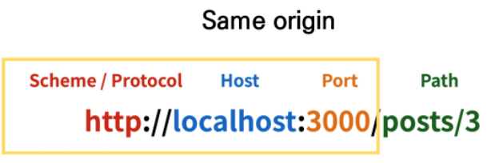
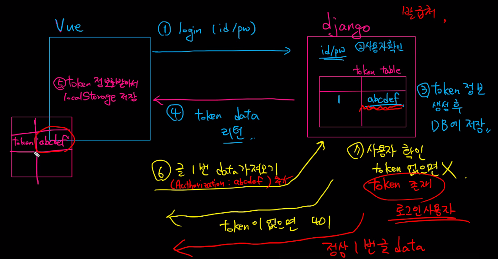

# Vue 04 (22.05.16)

### Server & Client

- Server

  클라이언트에게 '정보', '서비스'를 제공하는 컴퓨터 시스템
  정보 & 서비스(Django를 통해 응답한 template, DRF를 통해 응답한 JSON)

- Client

  사용자에게 서빙하는 대상
  
  서버에게 그 서버가 맡는(서버가 제공하는) 서비스를 요청하고, 서비스 요청을 위해 필요한 인자를 서버가 요구하는 방식에 맞게 제공하며, 서버로부터 반환되는 응답을 사용자에게 적절한 방식으로 표현하는 기능을 가진 시스템

> 정리
>
> Server는 "정보 제공, Data Base"
>
> DB와 통신하며 데이터를 CRUD
>
> 요청을 보낸 Client에게 이러한 정보를 응답
>
> Client는 "정보 요청 & 표현"
>
> Server에게 정보(데이터) 요청
>
> 응답받은 정보를 잘 가공하여 화면에 보여줌

### Start Project(Model+Serializer)

프로젝트 생성

앱 생성

필요한 앱 설치

setting.py에 앱 등록

AUTH_USER_MODEL 설정

User  모델 생성

### CORS

- Same-origin policy(SOP)

  "동일 출처 정책"

  특정 출처(origin)에서 불러온 문서나 스크립트가 다른 출처에서 가져온 리소스와 상호작용 하는 것을 제한하는 보안 방식

  잠재적으로 해로울 수 있는 문서를 분리함으로써 공격받을 수 있는 경로를 줄임

- Origin(출처)

  두 URL의 Protocol, Port, Host가 모두 같아야 동일한 출처라 할 수 있음

  예시 참고(p. 19)

- Same-origin 예시

settings.py commonpasswordvalidator : 비밀번호 걸러주는 애

Vue

로그인 → 토큰 키 획득 → 요청보낼 때 header에 추가

(axios로 요청보낼때는 header, config 부분에 작성)

