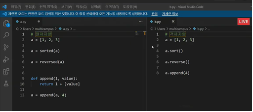

파이썬은 모든 것이 **객체(object)**

## OOP

- 객체

  객체는 특정 타입의 인스턴스(instance; 사례)

  - 예시

    123, 900, 5는 모두 int의 인스턴스

    'hello', 'bye'는 모두 string의 인스턴스

- 객체의 특징

  타입

  속성: 어떤 상태(데이터)를 가지는가?

  조작법: 어떤 행위(함수)를 할 수 있는가?

- 객체지향 프로그래밍

  객체지향 프로그래밍이란?  <=> 절차지향 프로그래밍(데이터와 함수로 인한 변화)

  - 데이터와 기능(메소드)분리, 추상화된 구조(인터페이스)

    [].sort()

  - 객체로 나누어져 있다

  ​    

  - 사각형 - 클래스(class)⭐
  - 각 사각형(R1, R2) - 인스턴스(instance)
  - 사각형의 정보 - 속성(attribute)(가로 길이, 세로 길이)
  - 사각형의 행동 - 메소드(넓이를 구한다, 높이를 구한다)

- 객체지향 프로그래밍이 필요한 이유

  - 현실 세계를 프로그램 설계에 반영(추상화)

- 장점

  객체 지향 프로그래밍은 프로그램을 유연하고 변경이 용이하게 만들기 때문에 대규모 소프트웨어 개발에 많이 사용됩니다.

  또한, 프로그래밍을 더 배우기 쉽게 하고 소프트웨어 개발과 보수를 간편하게 하며, 보다 직관적인 코드 분석을 가능하게 하는 장점을 가지고 있다.

### OOP 기초

- 기본 문법⭐

  - 클래스 정의

    class myclass:

- 객체 비교하기

  - ==
  - is : 두 변수가 동일한 객체를 가리키는 경우 True

- 인스턴스 변수⭐

  인스턴스들의 고유한 변수

  인스턴스가 생성된 이후 `instance`.`name`으로 접근 및 할당

- 인스턴스 메소드⭐

  호출 시, 첫번째 인자로 **인스턴스 자기자신(self)이 전달됨**(다른 단어로 써도 작동하지만 파이썬의 암묵적 규칙)

- self⭐

  인스턴스 자기자신

- 생성자 메소드⭐

  인스턴스 객체가 생성될 때 자동으로 호출되는 메소드

  인스턴스 변수들의 초기값을 설정: `_init_`메소드 자동 호출

- 매직 메소드

  - Double underscore(_)가 있는 메소드는 특수한 동작을 위해 만들어진 메소드로, 스페셜 메소드 혹은 매직 메소드라고 불림

  - 특정 상황에 자동으로 불리는 메소드

  - 예시

    `__str__`: 해당 객체의 

 

### 클래스

- 클래스 변수⭐

  - 한 클래스의 모든 인스턴스라도 똑같은 값을 가지고 있는 속성
  - 클래스 이름 대신 인스턴스 이름을 쓰면? 인스턴스 변수

- 클래스 메소드

  - 클래스를 조작하고 싶어
  - 메스드를 정의할 때 cls를 받도록

  - @classmethod 데코레이터를 사용하여 정의

- 인스턴스 메소드
  - 왠만한 메소드는 인스턴스 메소드(.sort())
  - 인스턴스를 조작하고 싶어
  - 함수 내부에 인스턴스를 던져주도록 설계
  - 메서드를 정의할 때 self로 받도록

- 인스턴스와 클래스 간의 이름공간⭐

  - 

- 스태틱 메소드⭐

  - 클래스나 인스턴스를 조작할 생각은 없는데 함수를 쓸거야

  - 클래스가 사용할 메소드
  - @staticmethod
  - 호출 시,

### 메소드 정리

- 메소드 정리⭐

  - 인스턴스 메소드

  - 클래스 메소드

    클래스를 의미하는 cls매개 변수를 통해

  - 스태틱 메소드

    유틸리티적인 부분들에서 사용

    주로 해당 클래스로 한정하는 용도로 사용(클래스에 종속)

### 객체 지향의 핵심개념

- 객체지향의 핵심 4가지

  - 추상화

    추상화 예시

  - 상속⭐

    클래스는 상속이 가능함

    모든 클래스는 객체(object)를 상속받음

    상속을 통한 메소드 재사용

    - 상속 관련 함수와 메소드

      ⭐super(): 

      mro 메소드(method resolution order): 해당 인스턴스의 클래스가 어떤 부모 클래스를 가지는지 확인하는 메소드(먼저 있는 클래스를 가져옴)

    - 다중 상속⭐

  - 다형성

    - 다형성(polymorphism)이란?

      동일한 메소드가 클래스에 따라 다르게 행동할 수 있음

      동일한 메시지에 대해 다른 방식으로 응답될 수 있음

    - 메소드 오버라이딩⭐

  - 캡슐화

    암묵적으로 존재하지만, 언어적으로는 존재하지 않음

    - 접근제어자 종류

      Public Access Modifier

      Protected Access Modifier: 언더바 1개로 시작, 암묵적 규칙, 부모 클래스 내부와 자식 클래스 내부에서만 사용 가능

      Private Access Modifier: 언더바 2개로 시작, 외부 호출 불가능
  
    - getter 메소드와 setter 메소드