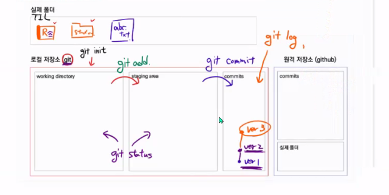

### Git (Distributed Version Control System)

Git: 분산 버전 관리 프로그램(DVCS), 소스코드의 버전을 관리할 수 있다.

### 준비하기

1. 윈도우에 git을 설치한다.(git bash 설치)

2. 초기 설치 완료 후 로컬 컴퓨터에 `Authot`정보를 설정해야한다.

   ```markdown
   $ git congig --global user.email 유저닉네임
   $ git congig --global user.name 유저네임
   
   $ git congig --global -1 #설정 값을 확인하는 명령어
   ```


### 로컬저장소

### 1. 저장소 초기화

```
$ git init

-/ssafy7 (master)   //master명 확인으로 git 관리여부 확인
```

| Working directory                                            | Staging Area                                                 | local Repository(commit)                       |
| ------------------------------------------------------------ | ------------------------------------------------------------ | ---------------------------------------------- |
| 실제 작업되는 공간<br /> 변경점이 나타나면 이곳에 파일이 등록 | commit 되기전 임시로 파일들이 보여지는 곳<br /> 이곳에서 commit 되어도 되는지 파일을 확인 | git으로 관리되는 파일들의 버전들이 저장되는 곳 |

> init 주의점: 

### 2. 상태를 확인

```
$ git status  #WD, SA의 상태를 확인하기 위한 명령어
```

* Untracked
  * git으로 관리되지 않았던 파일이 등록된 경우
  * WD에서 해당 단어를 확인할 수 있음
* Tracked
  * New file: git으로 관리되지 않았던 파일이 Staging Area에 등록되었을 때 확인할 수 있음
  * modified: git으로 관리되는데 수정된 파일이 Staging Area에 등록되었을 때


### 3. gitignore

> 주의: gitignore에 먼저 등록하고 add를 하자!
>
> 미리 add에 되어 있으면 gitignore에 등록되어 있어도 계속 관리가 된다.

* 프로젝트에 관련없는 파일을 등록하여 commit되지 않도록 하는 것

  * 민감한 개인 파일이나

  * 개인 컴퓨터 설정파일(OS에서 활용되는 파일)
  * IDE 환경 설정 파일(.idea/)
  * 가상환경 폴더 및 파일(venv/ )

* `.gitignore`파일을 생성(확장자는 따로 없음)

  * 제외하고 싶은 파일을 등록
  * 파일명을 적어주면 끝

* gitignore.io를 이용하면 편하게 gitignore 파일을 작성할 수 있음

  * 단, 우리가 생성한 파일은 우리가 직접 등록해야함(단순 참고용도인 파일들)


### 4. Commit을 위한 준비

```
$ git add 파일명
$ git add .   #현재 폴더 내에 있는 변경/추가된 파일 모두를 등록
```

* Working directory에서 staging area로 관리 파일들을 이동시키는 명령어
* staging area에서 관리 대상에 대한 판단을 하고 commit 여부를 결정

### 5. Commit 하기

```
$ git commit -m "커밋 메세지를 남기자! 유의미한 내용으로 작성"
```

* 버전 이력을 확정짓는 명령어
* 해당 시점의 파일 변경된 내용 상태를 스냅샷으로 기록해 남긴다.


### 6. Commit 이력 확인하기

```bash
$ git log
$ git log --oneline  #한줄로 축약해서 보여줌
$ git log -p   #파일의 변경 내용도 같이 보여줌
$ git log -숫자  #숫자만큼만 보여줌
```


## 원격 저장소(remote repository)

* github / gitlab

### 1. 원격 저장소 등록

* 사용하기 위해서는 로컬에 원격 저장소의 url 주소를 등록해야 함

```
$ git remote add 저장소별명(origin) 저장소주소
```

* 등록된 원격 저장소의 주소를 확인하는 방법

  ```bash
  $ git remote -v
  ```

* 저장소 삭제

```
$ git remote rm 저장소별명
```


### 2. 원격 저장소에 commit 내용 보내기

* 로컬에 저장된 commit을 원격 저장소로 전달하여 분선 버전 관리를 완성하는 부분

   ```bash
   $ git push 저장소별명 브랜치명
   
   $ git push -u origin master
   ```

   `-u`: --set-upstream 의 shortcut 형태이고 저장소 별명과 브랜치 명을 설정

----------

### 원격 저장소에서 내려받기

### 1. git clone

* `git init`, `git remote add`동작이 포함된 내려받기 명령어
* 아무것도 없는 상태일 때 사용
* `git clone 리모트레포주소`


### 2. git pull

* remote서버의 정보를 내려받는 명령어
* git이 적용되어 있어야 한다.(.git폴더가 존재해야함)
* remote정보가 등록되어 있어야 한다.
* `git pull 리모트별명 브랜치명`


### 기타)

### submodule warning 메세지를 봤다!

1. 어떤 폴더가 submodule인지 확인한다.
2. 해당 폴더로 찾아가서 .git 폴더를 제거한다.
3. 이미 staging area에 올라간 상태라면

  `git rm -rf --cached 폴더명`으로 해당 폴더를 staging area에서 working directory로 내린다.

4. git status로 다시 상태를 체크하고
5. git add로 staging area에 다시 올린다.
6. 다시 git status로 staging area에 올라온 상태를 파악하고
7. git commit을 한다.

* 싸피 1학기 과정에서는 사용계획X
* CLI환경에서(master)가 보이면 git init을 하지 않는게 좋다.


--------------


**1. 왜 Git을 이용한 버전 관리가 필요한가?**

`버전`: 컴퓨터 소프트웨어의 특정상태

`관리`

`프로그램`: 컴퓨터에서 실행될 때 특정 작업을 수행하는 일련의 명령어들의 모음


> 버전 관리 =  컴퓨터 소프트웨어의 특정 상태들을 관리하는 것?
>
> But, 우리는 이미 버전 관리를 알고 있다

```
마케팅관리_레포트_최종.docx
마케팅관리_레포트_진짜최종.docx
마케팅관리_레포트_진짜진짜최종.docx
마케팅관리_레포트_진짜리얼최종.docx
```

어느 것이 진짜 최종이지?


>  파일에 날짜와 시간을 적어봐!

```
마케팅관리_레포트_211201_1604.docx
마케팅관리_레포트_211202_1215.docx
마케팅관리_레포트_211203_0530.docx`
```

어느 부분을 수정했더라?


> 변경사항을 기록하는 파일을 만들어 봐!

```
마케팅관리_변경사항_211201_1604.docx
```

레포트 1개당 10억장이라면? 용량이 너무 크다..


> 맨 나중 파일과, 이전 변경사항만 남겨
>
> **(분산)버전 관리 프로그램**


* Git을 이용한 버전 관리

  중앙 집중식 버전 관리: 변경 이력을 중앙에서만 관리

  분산 버전 관리: 변경 이력을 모든 컴퓨터에서 관리

  위험 관리에는 분산 버전 관리가 용이


**2. Github를 이용한 포트폴리오 관리**

Github: TIL과제 제출

Gitlab: 과제제출


* git의 기본적인 구조

​	실제 폴더

​	`git init`

​	working directory: 내컴퓨터(대기실)

​	 `git add`

​	staging area: 확인/검수(입장)

​	`git commit`

​	commits: 저장소

​	`git status`: working directory와  staging area의 상태를 확인하는 명령어

​	`git log`: commit의 상태를 확인



* 상태

​	untracked: 처음으로 관리되는 대상(빨간색)

​	tracked: 관리되고 있는 대상

​	new: 처음 관리(초록색)
